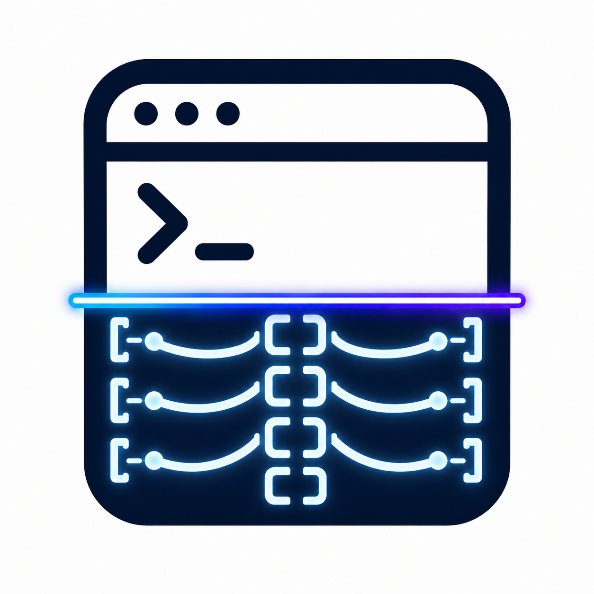

<p align="center">
  
</p>

# muxray

**muxray reads live tmux panes as deterministic JSON so an agent's control loop
knows what each pane is doing — without scraping terminal bytes.**

Stop scraping raw ANSI bytes and pattern-matching a moving TUI on every poll:
muxray turns each pane into one stable contract your loop can branch on — what's
in it, whether it changed since you last looked, and what the agent is doing.

`muxray` is a single, zero-dependency Go binary that makes the contents of tmux
panes legible to an LLM or coding agent. Its primary consumer is not a human at a
terminal — it is an agent that needs reliable, deterministic, machine-readable
answers to three questions, repeatedly and cheaply:

1. **What is in this pane?** — structured capture and snapshots.
2. **Did it change since I last looked?** — deterministic `changed: false`, or a
   compact, LLM-friendly diff when it did.
3. **What is the agent in this pane doing?** — program-specific status parsing
   for **Claude**, **Codex**, and **Copilot** into a deterministic state model
   (`idle`, `running`, `blocked`, `waiting_for_input`, `needs_approval`,
   `error`, `completed`, `unknown`).

Output is JSON by default. Every result is self-describing (schema version,
command, timestamp, target) so an agent can branch on it without scraping raw
terminal bytes itself.

---

## At a glance

Without `muxray`, your poll loop scrapes raw, ANSI-laden terminal bytes and guesses
what they mean:

```text
OpenAI Codex
  Working (esc to interrupt)
  Running command: go test ./...
```

With `muxray`, the same pane becomes one deterministic line your loop can branch on:

```sh
$ muxray status --pane work:1.0
```

```json
{ "classification": { "program": "codex", "status": "running", "evidence": "Working (esc to interrupt)" } }
```

*(Trimmed — the [full self-describing output](#example-output) also carries the
schema version, a confidence score, and the matched rule, with `--explain` for the
complete parser trace.)*

**Is this for you?** If you drive Claude/Codex/Copilot — or any TUI — inside tmux
from your own loop and need to know *what changed* and *what the agent is doing*,
yes. If you just want to read your own terminal by hand, you probably don't need it.

**Try it in 2 minutes:** [install](#install), then run
`muxray status --pane <your agent's pane>` — or `muxray scan --text` to classify
every pane at once.

- **Wiring an orchestrator?** A few lines poll `status`/`diff` per pane — see
  [Use it with your orchestrator](#use-it-with-your-orchestrator).
- **Want to contribute?** Teaching muxray a new program state is a good first PR —
  see [Contributing a program fixture](#contributing-a-program-fixture).

---

## Why an agent needs this

An agent orchestrating a Claude/Codex/Copilot session inside tmux otherwise has
to capture raw pane bytes, strip ANSI, guess whether anything changed, and
pattern-match a moving terminal UI on every poll. `muxray` does that once,
deterministically, behind a stable JSON contract — so the agent can poll
`muxray status` / `muxray diff` in a loop and trust the answer.

### Use it with your orchestrator

One agent in one pane is the easy case. The payoff grows when an **orchestration
framework** supervises *many* long-running agent sessions at once and has to answer
"what is each one doing right now?" on every tick. Frameworks like
[OpenClaw](https://github.com/openclaw/openclaw) and other multi-agent orchestrators
are a natural fit: wherever your orchestrator drives an interactive agent in a tmux
pane, its control loop can poll `muxray status` / `muxray diff` per pane and branch on
deterministic `{program, status}` JSON instead of scraping each session's raw bytes.

It also shares their grain: orchestrators like OpenClaw are **local-first** and run on
your own machine for privacy, and so is `muxray` — pane output (which can hold secrets)
is read locally and **never leaves the box** (no network egress; see Telemetry below).

> muxray doesn't ship an orchestrator plug-in — it's a small CLI with a stable JSON
> contract, so wiring it into a control loop is a few lines wherever you already manage
> tmux panes.

### Drop in the agent skill

For harnesses that load `SKILL.md` skills (OpenClaw, Claude Code, and other
[AgentSkills](https://agentskills.io) consumers), muxray ships its own — when to reach
for it, how to call it safely, and how to read the JSON back. It is **embedded in the
binary**, so an agent that has `muxray` on `PATH` can install it without the repo:

```bash
mkdir -p ~/.claude/skills/muxray && muxray skill > ~/.claude/skills/muxray/SKILL.md
```

The full bundle — wrapper scripts, a JSON cheat-sheet, and a worked example — lives at
[`skills/muxray/`](skills/muxray/); see its [README](skills/muxray/README.md) for the
`openclaw skills install` path.

---

## Install

### curl | sh (Linux/macOS)

```sh
curl -fsSL https://raw.githubusercontent.com/dandriscoll/muxray/main/install.sh | sh
```

Installs the latest release binary to `/usr/local/bin` (or `~/.local/bin`).
Override with `MUXRAY_VERSION=vX.Y.Z` or `MUXRAY_INSTALL_DIR=/path`. The installer
verifies the release checksum.

### go install

```sh
go install github.com/dandriscoll/muxray/cmd/muxray@latest
```

### From source

```sh
git clone https://github.com/dandriscoll/muxray && cd muxray
make build      # produces ./muxray
```

### Homebrew

Homebrew support is **planned**. Until then, use `curl | sh` or `go install`.

**Requirement:** `muxray` shells out to `tmux`, so tmux must be installed and on
your `PATH`. Run `muxray doctor` to check your environment.

---

## Quick start

```sh
# List every tmux session/window/pane as JSON
muxray list

# Classify what the agent in a pane is doing
muxray status --pane work:1.0

# Classify EVERY pane in one call (the fleet view; --text for a quick glance)
muxray scan --text

# Block until that pane is free / needs you, then act on the final state
muxray watch --pane work:1.0 --until idle,needs_approval --timeout 10m

# Snapshot a pane, do other things, then see what changed
muxray snapshot --pane %3
muxray diff --pane %3            # compares against the latest stored snapshot

# Everything at once (snapshot + diff + status)
muxray inspect --pane %3
```

### Pane targeting

`--pane` accepts the common tmux target forms:

| Form                    | Example          |
| ----------------------- | ---------------- |
| session name            | `work`           |
| session:window.pane     | `work:1.0`       |
| pane id                 | `%3`             |
| session id              | `$0`             |
| *(omitted)*             | the current pane (when run inside tmux) |

---

## Example output

### `muxray status` — program state detection

```json
{
  "schema_version": "2",
  "command": "status",
  "target": { "raw": "work", "session": "work" },
  "classification": {
    "program": "codex",
    "status": "running",
    "rule_id": "codex.running",
    "match_source": "rule:codex.running",
    "confidence": 0.88,
    "evidence": "Working (esc to interrupt)"
  },
  "tail_excerpt": ["OpenAI Codex", "  Working (esc to interrupt)", "  Running command: go test ./..."]
}
```

`program` and `status` are the load-bearing fields. `program` is the program
muxray recognized in the pane — `claude`, `codex`, `copilot`, `shell` (a pane
sitting at an interactive shell prompt — e.g. the agent exited or a remote/VM
connection dropped back to the shell; reported as `idle`), or `unknown` for any
pane it doesn't recognize (an editor, a pager, …). `rule_id` / `match_source`
and `evidence` make the classification **explainable** — pass `--explain` to get
the full parser trace, including every rule considered and why a result was
`unknown`.

### `muxray diff` — change detection

When nothing changed, the answer is deterministic:

```json
{ "command": "diff", "changed": false, "summary": "no changes", "added": [], "removed": [] }
```

When it did, the diff is compact and structured for an LLM:

```json
{
  "command": "diff",
  "changed": true,
  "summary": "+3 -2 lines, 1 hunk(s)",
  "added":   ["  Allow command?", "    $ npm install", "  [y/n]"],
  "removed": ["  Working (esc to interrupt)", "  Running command: go test ./..."],
  "context": ["OpenAI Codex"],
  "hunks": 1,
  "current_tail_excerpt": ["OpenAI Codex", "  Allow command?", "    $ npm install", "  [y/n]"],
  "previous_snapshot": "d0ac3a36726c",
  "current_snapshot": "2a802564c32f"
}
```

Use `--context N` for surrounding lines and `--full` to lift the compact cap.

More runnable examples are in [`examples/`](examples/).

### Snapshot / diff flow

```sh
muxray snapshot --pane %3 --out before.json   # capture + write to a file
# ... let the agent work ...
muxray diff --pane %3 --since before.json      # diff against that exact file
muxray diff --pane %3                           # or against the latest stored snapshot
```

Snapshots are stored under `${XDG_STATE_HOME:-~/.local/state}/muxray/snapshots`.
Because pane output can hold secrets, snapshot files are written user-private
(`0600`) under `0700` directories — including the `--out` destination — so other
local users on a shared host cannot read them (Unix mode bits; a no-op on
Windows). The **content hash** is computed over the *cleaned* text only (no timestamp, no
id), so the same pane content always hashes the same — `changed: false` is
reproducible across machines.

---

## Commands

| Command            | Purpose                                                        |
| ------------------ | -------------------------------------------------------------- |
| `muxray list`      | List sessions/windows/panes (structured)                       |
| `muxray snapshot`  | Capture a pane to the local store and/or `--out <file>`        |
| `muxray diff`      | Compare current pane against a previous snapshot (`--since`)   |
| `muxray status`    | Classify program state for the pane                            |
| `muxray scan`      | Classify **every** pane in one call (the fleet view)          |
| `muxray watch`     | Block until a pane reaches a target state (`--until`, `--timeout-exit`) |
| `muxray inspect`   | Snapshot + diff + status in one call                           |
| `muxray doctor`    | Report environment/tooling diagnostics                         |
| `muxray telemetry` | `telemetry show` prints exactly what telemetry would be sent   |
| `muxray bundle`    | Produce a sanitized diagnostic bundle for bug reports          |
| `muxray shim`      | Run a local credential-free fake LLM backend for a harness     |
| `muxray update`    | Update muxray in place from the latest GitHub release          |
| `muxray usage`     | Print the agent-facing calling contract (same as `USAGE.md`)   |
| `muxray skill`     | Print the embedded agent skill definition (same as `skills/muxray/SKILL.md`) |
| `muxray version`   | Print the version                                              |

Common flags: `--pane`, `--session <name>` (target a session by name; alternative
to `--pane`), `--json` (default), `--text`, `--lines N` (history cap, default 200),
`--debug`. Run `muxray <command> -h` for command-specific flags.

**Exit codes:** `0` ok · `1` internal · `2` usage · `3` tmux/capture · `4`
snapshot not found · `5` `watch` timed out (override per-call with
`watch --timeout-exit <code>`). `changed: true`/`false` are **both**
exit `0` — change is not an error. Errors are emitted as structured JSON on stderr with a `class` and a
`hint`, and tmux failures are never silently swallowed.

---

## Telemetry, diagnostics & privacy

> **tmux pane output can contain secrets** — API keys, tokens, file contents.
> `muxray` is built so that this content stays on your machine.

- **No network egress.** This version ships **no telemetry network sink at all.**
  There is nothing to leak. (The one exception is `muxray update`, which you run on
  purpose: it only *downloads* a release from GitHub and verifies its checksum — it
  sends no pane content, prompts, or telemetry. Like `brew upgrade`, it is explicit
  and opt-in.)
- **Content-free by construction.** The telemetry event type has *no field* that
  can hold raw pane text, prompts, completions, secrets, or environment — only
  counts, classes, booleans, and irreversible hashes. Run `muxray telemetry show`
  to see the exact event shape that would ever be emitted.
- **Opt-in.** Any future telemetry requires explicit config opt-in.
- **Kill switch.** `MUXRAY_NO_TELEMETRY=1` or `DO_NOT_TRACK=1` disables
  everything, including the local debug log. Telemetry failures are always
  non-fatal.
- **Local diagnostics.** `--debug` writes a content-free event to a local debug
  log. `muxray doctor` reports your environment. `muxray bundle` produces a
  **sanitized** diagnostic bundle for bug reports — pane content is omitted by
  default, and any explicitly included excerpt is secret-redacted (best effort).

---

## Testing architecture

`muxray` ships a layered test suite. The default `go test ./...` lane is
deterministic and network-free; tmux-dependent layers run when tmux is present
and **skip cleanly** when it is not (or under `-short`).

| Layer            | What it covers                                                              | Command |
| ---------------- | --------------------------------------------------------------------------- | ------- |
| **Unit**         | normalization, diff, snapshot, target parsing, telemetry redaction, CLI     | `go test ./...` |
| **Fixture**      | committed program transcripts → classification, self-checked against the fixture's labeled state | `go test ./internal/program` |
| **Golden**       | program classifications and a representative command output                | `go test ./...` (regenerate with `make fixtures`) |
| **tmux integration** | real tmux session on a private socket, captured through muxray          | `go test ./internal/tmux` |
| **Mock harness** | a dummy backend renders program-characteristic screens into a real tmux pane and asserts state transitions | `go test ./internal/tmux -run Harness` |
| **Nightly live drift** | drives real Claude/Codex/Copilot flows to catch upstream TUI drift   | nightly CI (see below) |

```sh
make test         # full suite (uses tmux if available)
make test-short   # skip the tmux integration + harness layers
make lint         # gofmt check + go vet
```

### Credential-free harness testing (LLM shims)

The mock-harness layer can drive the **real** Claude/Codex CLIs without any
provider API key, by pointing them at a local, deterministic fake backend — an
"LLM shim". `muxray shim` runs one:

```sh
# Terminal 1: start a fake Anthropic backend
muxray shim --provider anthropic --scenario approval
# muxray shim: anthropic (scenario=approval) listening on http://127.0.0.1:54321

# Terminal 2: point the real Claude CLI at it (no key required)
export ANTHROPIC_BASE_URL=http://127.0.0.1:54321
export ANTHROPIC_API_KEY=muxray-shim-no-key
claude                       # the real TUI, driven by the shim
muxray status --pane <that pane>   # -> claude/<state>
```

`--provider` is `anthropic` (Claude) or `openai` (Codex); `--scenario` is `text`
(plain reply → running/idle/completed), `approval` (a command request → approval
prompt), or `error`. The shim binds loopback only and never makes a network call.

The shim's HTTP surface is unit-tested in-process (no harness, no network — always
runs), and a real-`claude` end-to-end test runs where the `claude` CLI is
installed and skips cleanly otherwise. Copilot is not shimmable this way (its
GitHub-OAuth auth is not base-URL-overridable) and keeps the synthetic harness
path.

### Nightly drift checks

The [`nightly`](.github/workflows/nightly.yml) workflow runs the **full** test
suite every day on Linux and macOS. This is the primary early-warning signal for
parser drift: the deterministic fixture/golden/harness layers catch regressions
in *muxray's own* parsers with no secrets required.

A second, optional `live-drift` job runs only when the repository is configured
with provider access (`MUXRAY_LIVE_ENABLED=true` plus provider secrets). It
drives real Claude/Codex/Copilot flows, classifies the live panes, and **fails
only on a genuine parser regression** — provider outages, auth failures, rate
limits, and missing harnesses are reported distinctly and do not fail the job.
Artifacts uploaded for diagnosis are sanitized (no secrets, no raw content). See
[`scripts/live-drift.sh`](scripts/live-drift.sh).

---

## Contributing a program fixture

The program parsers are validated by fixtures, so adding coverage is easy:

1. Capture a real screen for a program state and save it as
   `internal/program/testdata/fixtures/<program>/<state>.txt`, where
   `<program>` is `claude`, `codex`, or `copilot` (or `generic` for non-agent
   output) and `<state>` is one of the status values (`running`,
   `needs_approval`, …).
2. Run `make fixtures` to generate the golden classification.
3. Run `go test ./internal/program`. The fixture test **self-checks** that the
   detected program and status match the directory and file names — so a
   mislabeled or non-representative fixture fails rather than silently passing.

Parser rules live in `internal/program/{claude,codex,copilot}.go` as small,
ordered, named rules. Each rule is a status plus a set of characteristic phrases;
the first matching rule wins, and a distinctive brand signature out-ranks a
generic UI phrase shared across harnesses.

---

## License

[MIT](LICENSE)
